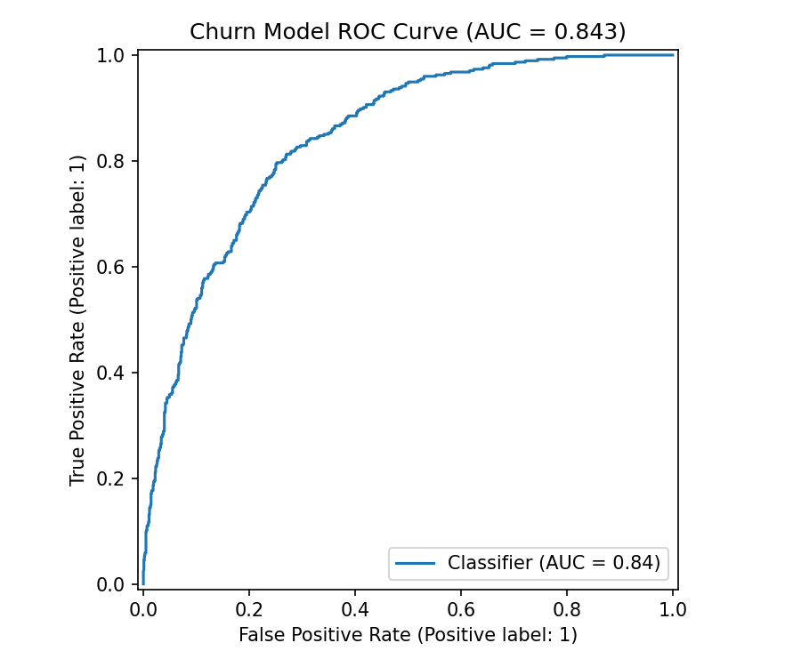
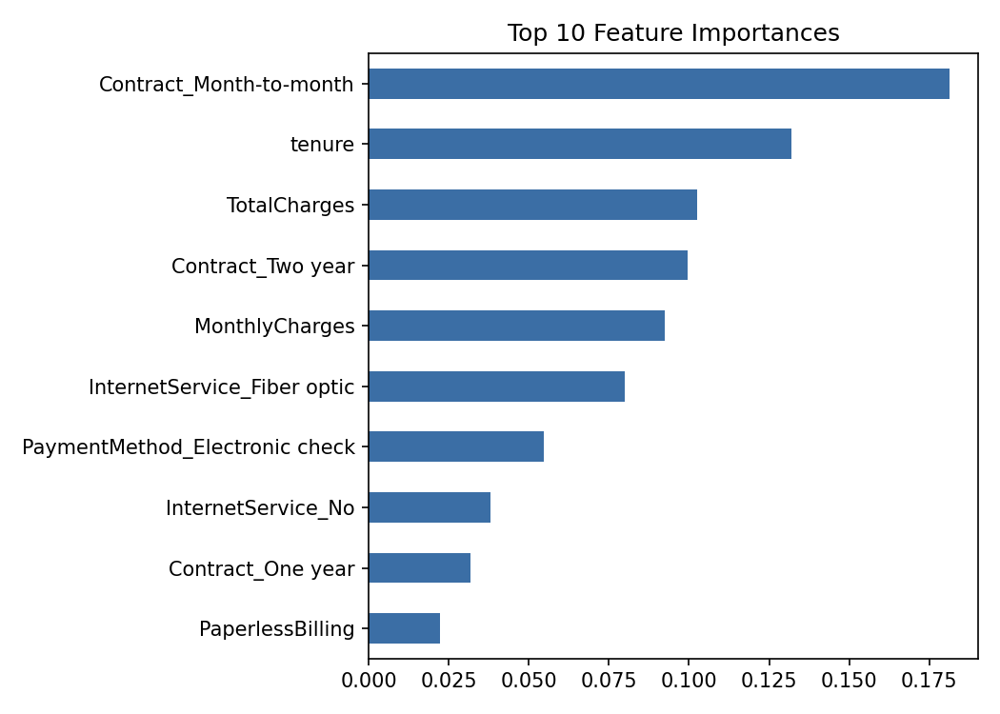

# Customer Churn Prediction — Model as a Deployable Service
 


 
**Dataset:** [Telco Customer Churn](https://www.kaggle.com/datasets/blastchar/telco-customer-churn) (IBM Sample Data Sets, via Kaggle) — 7,043 real customers of a telecom company, 21 raw columns.
 
**Business question:** Which customers are at risk of churning, and can that prediction be served reliably as part of a real system rather than living only in a notebook?
 
---
 
## Table of Contents
 
- [Why this project](#why-this-project)
- [Project structure](#project-structure)
- [Design decisions](#design-decisions)
- [How to run](#how-to-run)
- [Example request](#example-request)
- [Key findings](#key-findings)
- [Future improvements](#future-improvements)
---
 
## Why this project
 
Most student ML projects stop at a notebook that prints an accuracy score against a dataset that's already been cleaned for them. This one uses one of the most widely-cited real churn datasets in the field, **in its original raw form** — including a genuine data quality issue (`TotalCharges` is stored as text because 11 rows contain blank whitespace for brand-new customers who haven't been billed yet).
 
The resulting model is wrapped the way it would actually ship:
 
- ✅ Tested cleaning logic shared between training and serving
- ✅ A versioned model artefact
- ✅ A REST API
- ✅ CI that runs the tests automatically
---
 
## Project structure
 
This is a flat project — every script and file sits in the same folder (except the GitHub Actions workflow, which GitHub requires to live under `.github/workflows/`). No `src/`, `app/`, or `tests/` subfolders needed.
 
```
.
├── telco_customer_churn_raw.csv   # real Kaggle/IBM dataset, downloaded as-is
├── data_prep.py                   # cleaning functions (unit tested)
├── train_model.py                 # trains model, saves model.joblib + charts
├── main.py                        # FastAPI service exposing /predict
├── test_data_prep.py              # 10 unit tests for the cleaning functions
├── requirements.txt
├── .gitignore
├── .github/
│   └── workflows/
│       └── ci.yml                 # runs tests + lint on every push
├── model.joblib                   # created by train_model.py
├── roc_curve.png                  # created by train_model.py
└── feature_importance.png         # created by train_model.py
```
 
---
 
## Design decisions
 
### 1. Cleaning logic lives in one place
`data_prep.py` is imported by both `train_model.py` and the API (`main.py`). This avoids **train/serve skew** — a very common real bug where the notebook cleans data one way and production cleans it another, silently degrading model performance.
 
### 2. The `TotalCharges` blank-string bug is handled explicitly, not silently
`fix_total_charges()` converts the column to numeric and fills the 11 blank rows with `0` (all have 0 months tenure — they genuinely haven't been billed yet), rather than dropping rows or letting pandas guess.
 
### 3. Feature columns are saved alongside the model
`model.joblib` stores both the model and its feature columns, so inference always aligns columns to what the model was actually trained on — even if a request is missing a category seen in training.
 
### 4. Unit tests target the cleaning functions, not the model
Cleaning bugs are where real pipelines actually break, and they're deterministic and easy to test, unlike model output.
 
---
 
## How to run
 
```bash
# 1. Install dependencies
pip install -r requirements.txt
 
# 2. Train the model (dataset is already included in this repo)
python train_model.py
 
# 3. Run the unit tests (10 pass)
pytest test_data_prep.py -v
 
# 4. Start the API
uvicorn main:app --reload
```
 
The API runs at `http://127.0.0.1:8000/predict`, with interactive docs at [`/docs`](http://127.0.0.1:8000/docs).
 
> **Data source:** `telco_customer_churn_raw.csv` is included in this repo. Original source: https://www.kaggle.com/datasets/blastchar/telco-customer-churn
 
---
 
## Example request
 
```bash
curl -X POST http://127.0.0.1:8000/predict \
  -H "Content-Type: application/json" \
  -d '{"gender":"Female","SeniorCitizen":0,"Partner":"No","Dependents":"No","tenure":2,
       "PhoneService":"Yes","MultipleLines":"No","InternetService":"Fiber optic",
       "OnlineSecurity":"No","OnlineBackup":"No","DeviceProtection":"No","TechSupport":"No",
       "StreamingTV":"No","StreamingMovies":"No","Contract":"Month-to-month",
       "PaperlessBilling":"Yes","PaymentMethod":"Electronic check",
       "MonthlyCharges":95.0,"TotalCharges":190.0}'
```
 
**Response:**
 
```json
{"churn_probability": 0.8531, "churn_prediction": true}
```
 
---
 
## Key findings
 
| Metric | Result |
|---|---|
| Churn rate in dataset | **26.5%** (consistent with the widely-reported benchmark) |
| Test AUC (held-out data) | **0.843** |
| Overall accuracy | **76%** |
| Recall on churners | **77%** (after balancing class weights) |
 
Class weights were balanced because catching churners matters more than raw accuracy for this use case.
 
**Strongest churn signals:**
- **Contract type** — month-to-month customers churn far more than those on annual contracts
- **Tenure**
- **Total / monthly charges**
This is consistent with the intuitive story that new, high-paying, contract-free customers are the highest risk. Predictions behave sensibly: a new fiber-optic customer on a month-to-month contract scores **85% churn risk**.
 
### ROC Curve

 
### Feature Importance

 
---
 
## Future improvements
 
- [ ] **Model versioning** (e.g. MLflow) instead of a single overwritten `.joblib` file
- [ ] **`/predict/batch` endpoint** for scoring a CSV of customers at once
- [ ] **Data/feature drift monitoring** once in production — the biggest real risk to a deployed model isn't the training code, it's silent drift after launch
- [ ] **Gradient-boosted model comparison** (XGBoost/LightGBM) as a benchmark against the Random Forest
 
